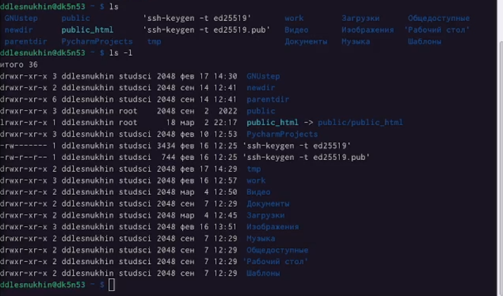

---
## Front matter
title: "Основы интерфейса взаимодействия
пользователя с системой Unix на уровне командной строки"
subtitle: "Операционные системы"
author: "Леснухин Даниил Дмитриевич"

## Generic otions
lang: ru-RU
toc-title: "Содержание"

## Bibliography
bibliography: bib/cite.bib
csl: pandoc/csl/gost-r-7-0-5-2008-numeric.csl

## Pdf output format
toc: true # Table of contents
toc-depth: 2
lof: true # List of figures
lot: true # List of tables
fontsize: 12pt
linestretch: 1.5
papersize: a4
documentclass: scrreprt
## I18n polyglossia
polyglossia-lang:
  name: russian
  options:
	- spelling=modern
	- babelshorthands=true
polyglossia-otherlangs:
  name: english
## I18n babel
babel-lang: russian
babel-otherlangs: english
## Fonts
mainfont: PT Serif
romanfont: PT Serif
sansfont: PT Sans
monofont: PT Mono
mainfontoptions: Ligatures=TeX
romanfontoptions: Ligatures=TeX
sansfontoptions: Ligatures=TeX,Scale=MatchLowercase
monofontoptions: Scale=MatchLowercase,Scale=0.9
## Biblatex
biblatex: true
biblio-style: "gost-numeric"
biblatexoptions:
  - parentracker=true
  - backend=biber
  - hyperref=auto
  - language=auto
  - autolang=other*
  - citestyle=gost-numeric
## Pandoc-crossref LaTeX customization
figureTitle: "Рис."
tableTitle: "Таблица"
listingTitle: "Листинг"
lofTitle: "Список иллюстраций"
lotTitle: "Список таблиц"
lolTitle: "Листинги"
## Misc options
indent: true
header-includes:
  - \usepackage{indentfirst}
  - \usepackage{float} # keep figures where there are in the text
  - \floatplacement{figure}{H} # keep figures where there are in the text
---

# Цель работы

Приобретение практических навыков взаимодействия пользователя с системой посредством командной строки.
# Задание

1. Определите полное имя вашего домашнего каталога. Далее относительно этого каталога будут выполняться последующие упражнения.
2. Выполните следующие действия:
2.1. Перейдите в каталог /tmp.
2.2. Выведите на экран содержимое каталога /tmp. Для этого используйте команду ls
с различными опциями. Поясните разницу в выводимой на экран информации.
2.3. Определите, есть ли в каталоге /var/spool подкаталог с именем cron?
2.4. Перейдите в Ваш домашний каталог и выведите на экран его содержимое. Определите, кто является владельцем файлов и подкаталогов?
3. Выполните следующие действия:
3.1. В домашнем каталоге создайте новый каталог с именем newdir.
3.2. В каталоге ~/newdir создайте новый каталог с именем morefun.
3.3. В домашнем каталоге создайте одной командой три новых каталога с именами
letters, memos, misk. Затем удалите эти каталоги одной командой.
3.4. Попробуйте удалить ранее созданный каталог ~/newdir командой rm. Проверьте,
был ли каталог удалён.
3.5. Удалите каталог ~/newdir/morefun из домашнего каталога. Проверьте, был ли
каталог удалён.
4. С помощью команды man определите, какую опцию команды ls нужно использовать для просмотра содержимое не только указанного каталога, но и подкаталогов,
входящих в него.
5. С помощью команды man определите набор опций команды ls, позволяющий отсортировать по времени последнего изменения выводимый список содержимого каталога
с развёрнутым описанием файлов.
6. Используйте команду man для просмотра описания следующих команд: cd, pwd, mkdir,
rmdir, rm. Поясните основные опции этих команд.
7. Используя информацию, полученную при помощи команды history, выполните модификацию и исполнение нескольких команд из буфера команд.

# Выполнение лабораторной работы

1. Выводим полный путь к нашему домашнему каталогу с помощью команды "pwd" (рис. @fig:001).

{#fig:001 width=70%}

2. Выведите на экран содержимое каталога /tmp. Используем такие команды как ls, ls -a, ls -l, данные команды выводят информацию о содержимом каталога, его файлы, скрытые файлы и информацию о пользователе. (рис. @fig:002). 

{#fig:002 width=70%}

3. Далее мы перехоим в каталог /var/spoo и проверяем наличие подкаталога cron. Он присутствует. (рис. @fig:003).

{#fig:003 width=70%}

4. Далее мы выводим содержимое нашего домашнего каталога, определяем, кто является владельцм каталога. (рис. @fig:004).

{#fig:004 width=70%}

5. Теперь мы должны создать подкаталог newdir, а в нем morefun.  Далее в домашнем каталоге мы создаем одной команой три подкаталога с именами letters, memos, misk. (рис. @fig:005).

{#fig:005 width=70%}

6. Далее мы пробуем удалить каталог ~/newdir с помощью команды rm, после чего удаляем каталог ~/newdir/morefun из домашнего каталога. (рис. @fig:006).

{#fig:006 width=70%}

Команда cd отвечает за переход между дирректориями.
Команда pwd позволяет вывести полный путь каталога, в котором мы работаем.
Команда mkdir позволяет создавать дирректории.
Команда rmdir позволяет удалять дирректории.
Команда rm удаляет подкаталоги.

7. Теперь с помощью команды man определим нужный набор опций команды ls. (рис. @fig:007).

{#fig:007 width=70%}

8. Далее при помощи команды history, выполняем модификацию и исполнение нескольких команд из буфера команд. (рис. @fig:008).

{#fig:008 width=70%}

# Выводы

Приобрели практические навыки взаимодействия пользователя с системой посредством командной строки.

# Список литературы{.unnumbered}

::: {#refs}
:::
