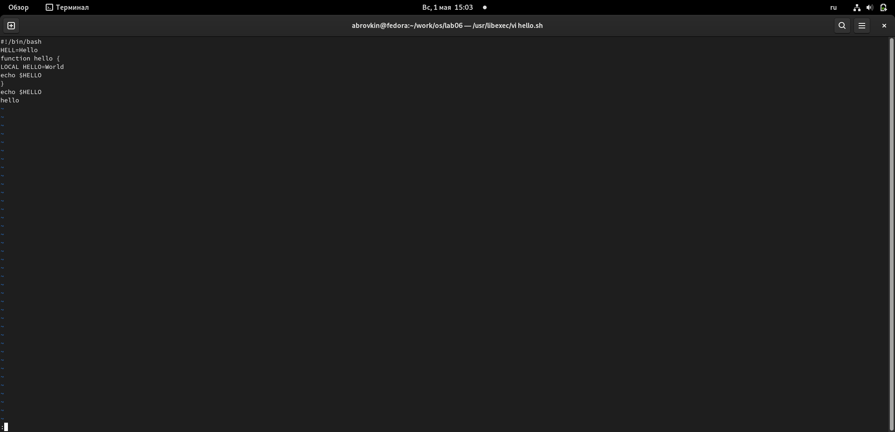
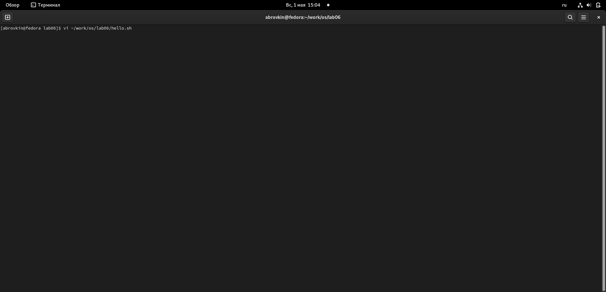
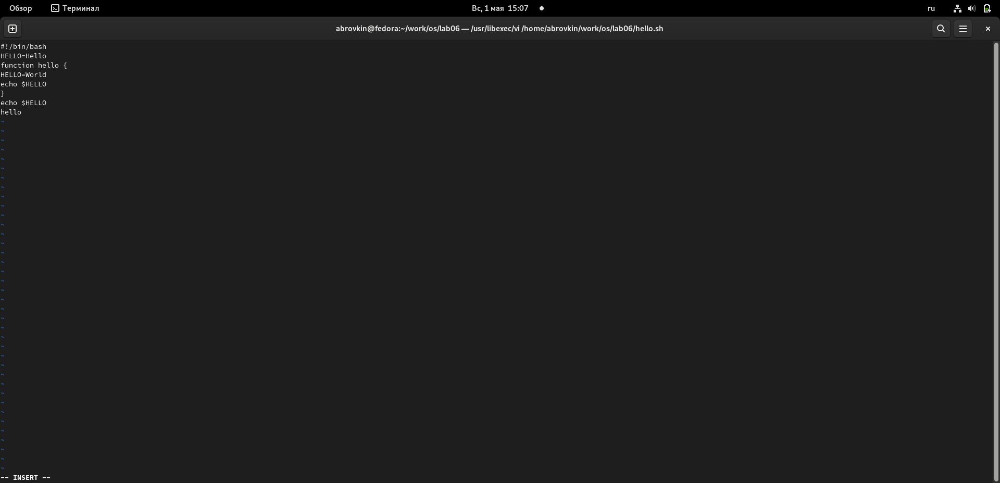

---
## Front matter
title: "Лабораторная работа-08"
subtitle: "Текстовой редактор vi"
author: "Леснухин Даниил НПИбд-02-22"

## Generic otions
lang: ru-RU
toc-title: "Содержание"

## Bibliography
bibliography: bib/cite.bib
csl: pandoc/csl/gost-r-7-0-5-2008-numeric.csl

## Pdf output format
toc: true # Table of contents
toc-depth: 2
lof: true # List of figures
lot: true # List of tables
fontsize: 12pt
linestretch: 1.5
papersize: a4
documentclass: scrreprt
## I18n polyglossia
polyglossia-lang:
  name: russian
  options:
	- spelling=modern
	- babelshorthands=true
polyglossia-otherlangs:
  name: english
## I18n babel
babel-lang: russian
babel-otherlangs: english
## Fonts
mainfont: PT Serif
romanfont: PT Serif
sansfont: PT Sans
monofont: PT Mono
mainfontoptions: Ligatures=TeX
romanfontoptions: Ligatures=TeX
sansfontoptions: Ligatures=TeX,Scale=MatchLowercase
monofontoptions: Scale=MatchLowercase,Scale=0.9
## Biblatex
biblatex: true
biblio-style: "gost-numeric"
biblatexoptions:
  - parentracker=true
  - backend=biber
  - hyperref=auto
  - language=auto
  - autolang=other*
  - citestyle=gost-numeric
## Pandoc-crossref LaTeX customization
figureTitle: "Рис."
tableTitle: "Таблица"
listingTitle: "Листинг"
lofTitle: "Список иллюстраций"
lotTitle: "Список таблиц"
lolTitle: "Листинги"
## Misc options
indent: true
header-includes:
  - \usepackage{indentfirst}
  - \usepackage{float} # keep figures where there are in the text
  - \floatplacement{figure}{H} # keep figures where there are in the text
---

# Цель работы

Познакомиться с операционной системой Linux.Получить практические навыки работы с редактором vi,установленным по умолчанию практически во всех дистрибутивах

# Задание 1 Создание нового файла с использованием vi

1. Создайте каталог с именем ~/work/os/lab06.
2. Перейдите во вновь созданный каталог.
3. Вызовите vi и создайте файл hello.sh
4. Нажмите клавишу i и вводите следующийтекст.
5. Нажмите клавишу Esc для перехода в командный режим после завершения ввода
текста.
6. Нажмите : для перехода в режим последней строки и внизу вашего экрана появится
приглашение в виде двоеточия.
7. Нажмите w (записать)и q (выйти),азатемнажмитеклавишу Enter длясохранения
вашеготекста и завершения работы.
8. Сделайте файл исполняемым

# Задание 2  Редактирование существующего файла

1. Вызовите vi на редактирование файла
2. Установите курсор в конец слова HELL второй строки.
3. ПерейдитеврежимвставкиизаменитенаHELLO.Нажмите Esc длявозвратавкоманд-
ный режим.
4. Установите курсор на четвертую строку и сотрите слово LOCAL.
5. Перейдите в режим вставки и наберите следующий текст: local, нажмите Esc для
возврата в командный режим.
6. Установитекурсорнапоследнейстрокефайла.Вставьтепосленеёстроку,содержащую
следующийтекст: echo $HELLO.
7. Нажмите Esc для перехода в командный режим.
8. Удалите последнюю строку.
9. Введите команду отмены изменений u для отмены последней команды.
10. Введитесимвол : дляпереходаврежимпоследнейстроки.Запишитепроизведённые
изменения и выйдите из vi.

# Выполнение лабораторной работы
# Задание 1. Создание нового файла с использованием vi

Создаю каталог с именем ~/work/os/lab06.(рис. [-@fig:001])
Перехожу во вновь созданный каталог.(рис. [-@fig:002])
Вызвал vi и создаю файл hello.sh

{ #fig:001 width=70% }

{ #fig:002 width=70% }

Нажимаю клавишу i и ввожу следующий текст:(рис. [-@fig:003])

1 #!/bin/bash
2 HELL=Hello
3 function hello {
4 LOCAL HELLO=World
5 echo $HELLO
6 }
7 echo $HELLO
8 hello

{ #fig:003 width=70% }

Далее нажимаю клавишу Esc для перехода к командный режим после завершения ввода текста.(рис. [-@fig:004])
Также нажимаю ":" для перехода в режим последней строки и внизу экрана появилось приглашение в виде двоеточия.

{ #fig:004 width=70% }

Нажимаю w(записать) и q(выйти), а затем нажал клавину Enter для сохранения текста и завершения работы.(рис. [-@fig:005])

{ #fig:005 width=70% }

Сделал файл исполняемым.(рис. [-@fig:006])

{ #fig:006 width=70% }

# Задание 2. Редактирование существующего файла

Вызываю vi на редактирование файла.(рис. [-@fig:007])

{ #fig:007 width=70% }

Установил курсор в конец слова HELL второй строки.(рис. [-@fig:008])

{ #fig:008 width=70% }

Далее перехожу в режим вставки и заменил его на HELLO,  нажал Esc для возврата в командый режим.(рис. [-@fig:009])

{ #fig:009 width=70% }

Установлю курсор на четвертую строку и сотру слова LOCAL.(рис. [-@fig:010])

{ #fig:010 width=70% }

Перешел в режим вставки и набрал следующий текст: local, нажал Esc для возврата в командный режим.(рис. [-@fig:011])

 { #fig:011 width=70% }
 
Установил курсор на последней строке файла. Вставил после неё строку, содержащую следующий текст: echo $HELLO.(рис. [-@fig:012])

{ #fig:012 width=70% }

Нажал Esc для перехода в командный режим.
Удалил последнюю строку.(рис. [-@fig:013])

# Вывод

Я познакомился с операционной системой Linux, получил практические навыки работы с редактором vi, установленным по умолчанию практически во всех дистрибутивах.

# Контрольные вопросы

1. Дайте краткую характеристику режимам работы редактора vi.

2. Как выйти из редактора,не сохраняя произведённые изменения?

3. Назовите и дайте краткую характеристику командам позиционирования.

4. Что для редактора vi является словом?

5. Каким образом из любого места редактируемого файла перейти в начало (конец)
файла?

6. Назовите и дайте краткую характеристику основным группам команд редактирования.

7. Необходимо заполнить строку символами $.Каковы ваши действия?

8. Как отменить некорректное действие,связанное с процессом редактирования?

9. Назовите и дайте характеристику основным группам команд режима последней строки.

10. Как определить,не перемещая курсора,позицию,в которой заканчивается строка?

11. Выполните анализ опций редактора vi (сколько их,как узнать их назначение ит.д.).

12. Как определить режим работы редактора vi?

13. Постройте граф взаимосвязи режимов работы редактора vi.

# Ответы на контрольные вопросы:

1. Краткая характеристика режимов работы редактора vi:
– командный режим — предназначен для ввода команд редактирования и навигации по редактируемому файлу;
– режим вставки — предназначен для ввода содержания редактируемого файла;
– режим последней (или командной) строки — используется для записи изменений
в файл и выхода из редактора.

2. Выйти из редактора, не сохраняя произведённые изменения, можно используя клавиши «:q!» в командном режиме.
3. Краткую характеристика команд позиционирования:
– 0 (ноль) — переход в начало строки;
– $ — переход в конец строки;
– G — переход в конец файла;
– n G — переход на строку с номером n.

4. Для редактора vi словом является: пробел; буквы, находящиеся между двумя пробелами.

5. Из любого места редактируемого файла перейти в конец файла можно с помощью клавишы G и курсора вниз, а в начало – курсор вверх.

6. Краткая характеристика основных групп команд редактирования:
Вставка текста
– а — вставить текст после курсора;
– А — вставить текст в конец строки;
– i — вставить текст перед курсором;
– n i — вставить текст n раз;
– I — вставить текст в начало строки.
Вставка строки
– о — вставить строку под курсором;
– О — вставить строку над курсором.
 Удаление текста
– x — удалить один символ в буфер;
– d w — удалить одно слово в буфер;
– d $ — удалить в буфер текст от курсора до конца строки;
– d 0 — удалить в буфер текст от начала строки до позиции курсора;
– d d — удалить в буфер одну строку;
– n d d — удалить в буфер n строк.
 Отмена и повтор произведённых изменений
– u — отменить последнее изменение;
– . — повторить последнее изменение.
Копирование текста в буфер
– Y — скопировать строку в буфер;
– n Y — скопировать n строк в буфер;
– y w — скопировать слово в буфер.
Вставка текста из буфера
– p — вставить текст из буфера после курсора;
– P — вставить текст из буфера перед курсором.
 Замена текста
– c w — заменить слово;
– n c w — заменить n слов;
– c $ — заменить текст от курсора до конца строки;
– r — заменить слово;
– R — заменить текст.
Поиск текста
– / текст — произвести поиск вперёд по тексту указанной строки символов текст;
– ? текст — произвести поиск назад по тексту указанной строки символов текст.

7. Чтобы заполнить строку символами $ можно использовать клавиши ni(вставить текст n раз).

8. Отменить некорректное действие, связанное с процессом редактирования, можно с помощью клавиши «.».

9. Характеристика основных групп команд режима последней строки:
Копирование и перемещение текста
– : n,m d — удалить строки с n по m;
– : i,j m k — переместить строки с i по j, начиная со строки k;
– : i,j t k — копировать строки с i по j в строку k;
– : i,j w имя-файла — записать строки с i по j в файл с именем имя-файла.
Запись в файл и выход из редактора
– : w — записать изменённый текст в файл, не выходя из vi;
– : w имя-файла — записать изменённый текст в новый файл с именем имяфайла;
– : w ! имя-файла — записать изменённый текст в файл с именем имяфайла;
– : w q — записать изменения в файл и выйти из vi;
– : q — выйти из редактора vi;
– : q ! — выйти из редактора без записи;
– : e ! — вернуться в командный режим, отменив все изменения, произведённые со времени последней записи.

10. Определить, не перемещая курсора, позицию, в которой заканчивается строка, можно используя клавишу $ (переход в конец строки).

11. Опции редактора vi позволяют настроить рабочую среду. Для задания опций
используется команда set (в режиме последней строки):
– : set all — вывести полный список опций;
– : set nu — вывести номера строк;
– : set list — вывести невидимые символы;
– : set ic — не учитывать при поиске, является ли символ прописным или
строчным.
Если вы хотите отказаться от использования опции, то в команде set перед именем опции надо поставить no.

12. Определить режим работы редактора vi можно по последней командной строке.

13. Взаимосвязь режимов работы редактора vi:
«Командный режим»     -     «Режим вставки»
                          \                             /
                 «Режим командной строки»

